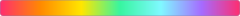

# Plasma Pixel

A design identity built on one mechanism: **colour that moves through a shape
instead of sitting on it.** Near-black surfaces, pixel type, zero radius, hard
offset shadows — all of it there to give one moving thing a still surface to move
against.

It began as the visual language for a macOS menu-bar app that watches a live
number, and it is written here to travel to other surfaces without being redrawn.

## Palette

| Name | Colour | Hex | Use |
|------|--------|-----|-----|
| void |  | `#05000E` | Background (rare) |
| panel |  | `#0B0018` | UI surfaces |
| border |  | `#2A1F44` | Borders, outlines |
| borderSoft |  | `#3A2C5E` | Subtle borders |
| cyan |  | `#7FF9FF` | Accents, marks |
| magenta |  | `#FF2D6F` | Primary accent, spikes |
| yellow |  | `#FFE600` | Warning, low balance |
| violet |  | `#A56BFF` | Highlights, daily summary |
| green |  | `#37F5A0` | Positive states |
| orange |  | `#FF8A00` | Warm accents |
| textPrimary |  | `#E7E2F5` | Body text (light) |
| textSecondary |  | `#8E86A8` | Secondary text |
| textTertiary |  | `#5E5580` | Tertiary text |
| ultraAction |  | `#FF7A1A` | Strong action calls |

**Gradient (seamless tile):**



`linear-gradient(180deg,#FF2D6F 0%,#FF8A00 17%,#FFE600 34%,#37F5A0 50%,#7FF9FF 67%,#A56BFF 84%,#FF2D6F 100%)`

---


---

## Read in this order

1. **`IDENTITY.md`** — what the identity is, its five principles, the densities it
   works at, where it does not belong, and how it dies.
2. **`core/MIX.md`** — the mechanism in full: algorithm, scale rules, the three
   variants, the kill switch, and ports for CSS / SwiftUI / canvas / static.
3. **`core/COMPONENTS.md`** — platform-agnostic recipes: buttons, frames, inputs,
   charts, tables, navigation, and the complete motion inventory.
4. **`core/platforms/`** — the identity meeting each platform's real constraints:
   what it forbids, what it forces, what the Mix looks like there, and per-platform
   checks. Read the one you are building on before you start.
5. **`core/DESIGN.md`** — the same material condensed into one self-contained file.
   Paste it into a design-to-code tool as-is.

```
plasma-pixel-ds/
├── IDENTITY.md
├── core/
│   ├── DESIGN.md          one-file summary, pasteable
│   ├── MIX.md             the mechanism
│   ├── COMPONENTS.md      agnostic component recipes
│   ├── platforms/         macOS · iOS · watchOS · web — where the platform wins
│   ├── tokens/            tokens.json is the source of truth
│   └── examples/          live sheet at open density
├── apps/
│   └── saldobar/          the first application — spec, handoff, prototypes
├── scripts/               token generator (tokens.json → css + swift)
├── fonts/                 what to download; nothing vendored
├── VERSIONING.md          what counts as a breaking change to an identity
└── CONTRIBUTING.md        the two questions any change has to answer
```

## Using it on a new surface

Never hand-edit `tokens.css` or `PlasmaPixelTokens.swift` — they are generated:
`node scripts/generate-tokens.mjs`.

1. Import `core/tokens/tokens.css` (or generate your platform's equivalent from
   `tokens.json`). Bundle Silkscreen and IBM Plex Mono.
2. Implement the Mix **once**, as a single reusable component or modifier with the
   kill switch inside it.
3. Pick your density from `IDENTITY.md` and decide, before designing, which single
   element is the hero. One per surface.
4. Build everything else flat, from `COMPONENTS.md`.
5. Run the twelve checks in `apps/saldobar/SPEC.md §10` — they are written against
   that app's numbers, but the arithmetic ones apply anywhere.

The most common failure is applying the Mix generously. A large surface is mostly
prose, so proportionally **less** of it qualifies, not more.

## Open Design package

`design-systems/plasma-pixel/` is an importable package for
[Open Design](https://open-design.ai): `manifest.json` + `DESIGN.md` +
`tokens.css` (the shared OD token contract mapped from `tokens.json`, plus the
`--pp-*` brand extensions), `USAGE.md`, a `components.html` fixture that proves
the tokens compose (Mix hero, buttons, inputs, toggles, cards, table, nav,
status dots, shared-field chart), and derived `design-tokens.json`,
`tailwind-v4.css`, `components.manifest.json`.

To use it in Open Design: copy `design-systems/plasma-pixel/` into your Open
Design install's `design-systems/` folder (the picker catalogs it on refresh),
or import this GitHub repo with `od design-systems import-github`. Agents that
fall back to reading this repo directly will find the same system in
`PROMPT.md`.

The generated files in the package come from `tokens.json`:
`node scripts/generate-od-package.mjs`. `DESIGN.md`, `USAGE.md`, `components.html`
and `manifest.json` are authored. If your Open Design build runs `pnpm guard`
and rejects the `--pp-*` extensions, add them to
`BRAND_EXTENSIONS["plasma-pixel"]` in its token schema.

## Fonts

**Silkscreen** and **IBM Plex Mono**, both OFL, both required — there is no system
equivalent. Not vendored here; download from Google Fonts (Silkscreen Regular +
Bold, IBM Plex Mono Regular + SemiBold).

## Applications

| App | Platform | Status |
|---|---|---|
| **SaldoBar** | macOS menu bar + watchOS alerts | hi-fi, ready to implement — `apps/saldobar/` |

## License

Docs and tokens MIT (`LICENSE`). The two typefaces are OFL and not covered by it.
